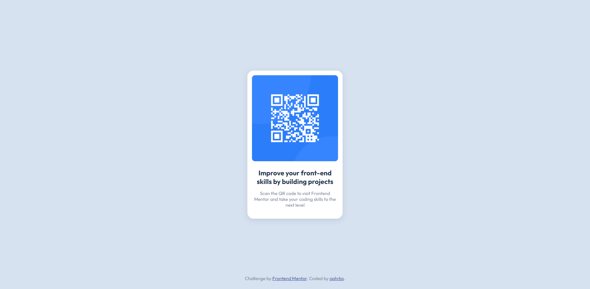

# Frontend Mentor - QR code component solution

## Table of contents

- [Overview](#overview)
  - [Brief](#brief)
  - [Screenshot](#screenshot)
  - [Links](#links)
- [My process](#my-process)
  - [Built with](#built-with)
  - [What I learned](#what-i-learned)

## Overview

### Screenshot

### Brief

Your challenge is to build out this QR code component and get it looking as close to the design as possible.
You can use any tools you like to help you complete the challenge. So if you've got something you'd like to practice, feel free to give it a go.

### Links

- [Frontend Mentor Challenge URL](https://www.frontendmentor.io/challenges/qr-code-component-iux_sIO_H)

## My process

### Built with

- HTML5
- CSS3

### What I learned

The main focus of this challenge probably was centering a div both vertically and horizontally. Thankfully, with the existence of Flexbox this became so much easier. Nonetheless, the trick here was setting the body to have 100% of the page height so I could center the main vertically with no problems.
